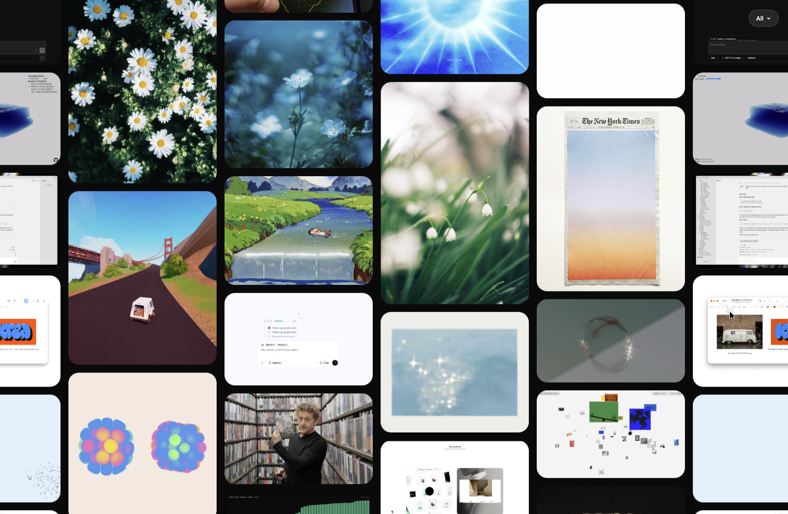

# Masonry-grid-windows

An infinite pannable masonry grid for your Twitter/X bookmarks. Browse bookmarks visually, open them in a lightbox, and optionally filter them by X bookmark folder.

This repo is a Windows-friendly modification of [destefanis/twitter-bookmarks-grid](https://github.com/destefanis/twitter-bookmarks-grid), with the original grid UI kept intact and the sync/export layer adapted around [@afar1](https://github.com/afar1)'s [fieldtheory-cli](https://github.com/afar1/fieldtheory-cli).




## What changed

This fork is set up to work cleanly on Windows:

- No macOS Keychain logic
- No Chrome Safe Storage dependency
- No browser profile cookie extraction in this repo
- Folder sync uses explicit `ct0` and `auth_token` cookies from Firefox/X
- Export paths are configurable and safe on Windows

The fetch/sync/export layer is Windows-friendly. The grid UI and browsing behavior are unchanged.

## Requirements

- Windows with PowerShell
- Node.js 20+
- Firefox logged into `https://x.com`
- `fieldtheory` CLI installed globally

## Windows setup

### 1. Clone and install

```powershell
git clone https://github.com/Mukund1046/Masonry-grid-windows.git
cd Masonry-grid-windows
npm install
```

Install Field Theory globally if you do not already have it:

```powershell
npm install -g fieldtheory
```

### 2. Important PowerShell note

PowerShell already uses `ft` as an alias for `Format-Table`.

Do not use:

```powershell
ft sync
```

Use this instead:

```powershell
& "C:\Users\YOUR_NAME\AppData\Roaming\npm\ft.cmd" sync
```

### 3. Choose where Field Theory writes bookmark data

This repo works well if you point Field Theory at the local `bookmarks` folder inside the repo:

```powershell
$env:FT_DATA_DIR="D:\Downloads\XMasonry\twitter-bookmarks-grid\bookmarks"
```

Then sync your bookmarks:

```powershell
fieldtheory sync
```

If you need to pass cookies manually to Field Theory, do that there. This repo does not depend on Field Theory's browser cookie extraction.

### 4. Create your local `.env`

Copy the template:

```powershell
Copy-Item .env.example .env
```

Open `.env` and set your X cookies:

```env
X_CT0=your_ct0_here
X_AUTH_TOKEN=your_auth_token_here
```

These values should come from Firefox DevTools while logged into `https://x.com`.

How to get them:

1. Open Firefox and go to `https://x.com`
2. Open DevTools
3. Go to the storage/cookies view for `https://x.com`
4. Copy the `ct0` cookie value
5. Copy the `auth_token` cookie value
6. Paste them into `.env`

Important:

- `X_CT0` is the shorter CSRF token
- `X_AUTH_TOKEN` is the long auth cookie
- If they are swapped, folder sync will fail with `401` or `403`
- Re-copy them if X logs you out or rotates the session

### 5. Optional path overrides

The repo will auto-detect bookmark input/output paths, but you can override them in `.env` if you want:

```env
# Where fieldtheory wrote bookmarks.jsonl
FT_DATA_DIR=D:\Downloads\XMasonry\twitter-bookmarks-grid\bookmarks
X_BOOKMARKS_JSONL=D:\Downloads\XMasonry\twitter-bookmarks-grid\bookmarks\bookmarks.jsonl

# Where this repo writes generated JSON
X_OUTPUT_DIR=.\output
X_BOOKMARKS_OUTPUT=.\output\bookmarks-data.json
X_FOLDERS_OUTPUT=.\output\folders-data.json
```

Defaults:

- Input bookmarks JSONL:
  `X_BOOKMARKS_JSONL` if set
- Otherwise:
  `FT_DATA_DIR\bookmarks.jsonl` if present
- Otherwise:
  `.\bookmarks\bookmarks.jsonl`

- Output files:
  repo root by default

## Run the workflow

### 1. Sync bookmarks with Field Theory

```powershell
$env:FT_DATA_DIR="D:\Downloads\XMasonry\twitter-bookmarks-grid\bookmarks"
fieldtheory sync
```

### 2. Sync X bookmark folders

```powershell
npm run sync:folders
```

What this does:

1. Calls X's internal GraphQL endpoints using your `X_CT0` and `X_AUTH_TOKEN`
2. Fetches your bookmark folders
3. Fetches bookmarks inside each folder
4. Writes `folders-data.json`

If X returns `0 folders`, either:

- you do not actually use bookmark folders on X, or
- X changed the response shape and the parser needs to be updated

### 3. Export bookmarks for the grid

```powershell
npm run export:bookmarks
```

This reads your `bookmarks.jsonl`, merges in `folders-data.json` if available, and writes `bookmarks-data.json`.

### 4. Start the local viewer

```powershell
node server.js
```

Then open:

```text
http://localhost:3000
```

## Files used by the workflow

- `sync-folders.js`
  Uses your `X_CT0` and `X_AUTH_TOKEN` to fetch X bookmark folders
- `export-bookmarks.js`
  Reads bookmark JSONL and creates the UI-ready export
- `config.js`
  Shared `.env` and path resolution logic
- `.env`
  Your local cookies and optional path overrides
- `bookmarks/bookmarks.jsonl`
  Field Theory bookmark archive
- `folders-data.json`
  Generated folder mapping
- `bookmarks-data.json`
  Generated UI data

## Troubleshooting

### `Missing X_CT0` or `Missing X_AUTH_TOKEN`

Your `.env` is missing one or both values, or PowerShell does not have them in the environment.

### `403` or `401` during `npm run sync:folders`

Usually one of these:

- `X_CT0` and `X_AUTH_TOKEN` are swapped
- the cookies are stale
- X logged you out
- the copied values include extra spaces or quotes

Re-copy both cookies from Firefox and try again.

### `Found 0 folders`

This is valid if your X account does not use bookmark folders.

If you do use folders and expected them to appear, X may have changed the GraphQL response shape or endpoint behavior.

### `Bookmarks JSONL not found`

Set one of:

```env
FT_DATA_DIR=D:\path\to\bookmarks
```

or

```env
X_BOOKMARKS_JSONL=D:\path\to\bookmarks.jsonl
```

### `Unexpected end of JSON input`

This repo has already been updated to avoid the old blind JSON parsing failure. If you still see parsing-related errors, it usually means X returned an empty or invalid response and the response handling needs another adjustment.

## Excluding bookmarks

To hide specific bookmarks from the grid, add tweet IDs to `EXCLUDED_IDS` in [export-bookmarks.js](D:\Downloads\XMasonry\twitter-bookmarks-grid\export-bookmarks.js#L13).

## Safe Git usage

Do not commit:

- `.env`
- `bookmarks/`
- `bookmarks-data.json`
- `folders-data.json`
- `output/`

Those are already ignored by [.gitignore](D:\Downloads\XMasonry\twitter-bookmarks-grid\.gitignore#L1).

You can safely commit:

- `sync-folders.js`
- `export-bookmarks.js`
- `config.js`
- `.env.example`
- UI files
- README updates

## How it works

- Masonry positions are computed as data and a fixed DOM pool is recycled while you pan
- Lightbox animation uses Motion One springs
- Folder sync uses X internal GraphQL endpoints, not the public API
- The UI stays static and simple; the work happens in the sync/export layer

## Caveat

This project depends on X internal endpoints and response shapes. X can change:

- GraphQL query IDs
- response object paths
- auth requirements

If that happens, the UI will still be fine, but `sync-folders.js` may need a small maintenance update.

## License

MIT
